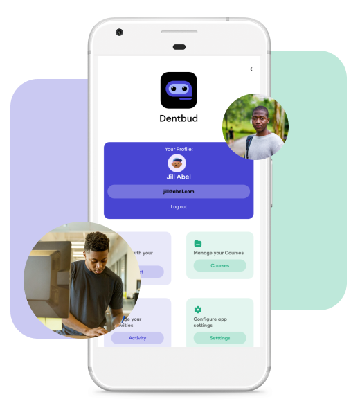
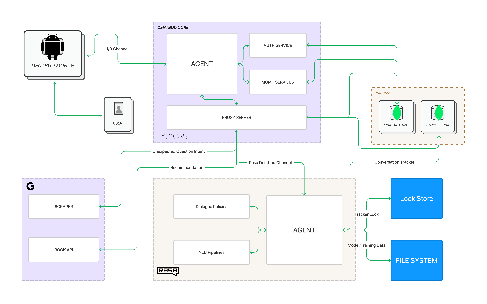

# Dentbud

Dentbud is a mobile-based smart personal assistant (SPA) for students. It's specially built to help students better manage their time and activities. It is built with React Native, Node.js (Express) and the Rasa Python Framework.



## Project Structure

The project is divided into four (4) sections:

1. `frontend-rn` (mobile frontend)
2. `backend-express` (core backend)
3. `backend-rasa` (nlu backend)
3. `frontend-web` (app landing)

## Getting Started

Follow the steps below to set up the project locally

1.  Clone repo:

  ```bash
  [HTTPS] - git clone git@github.com:IamGideonIdoko/dentbud.git
  [SSH] - git clone https://github.com/IamGideonIdoko/dentbud.git
  ```

2. Install `frontend-rn` dependencies:

  ```bash
  make frontend-rn-deps
  ```

3. Install `backend-express` dependencies:

  ```bash
  make backend-express-deps
  ```

4. Install `backend-rasa` dependencies

    i. Create a conda environment

     ```bash
     make conda-env
     ```

    ii. Activate created conda environment

     ```bash
     conda activate rasa_env
     ```

    iii. Update your `pip` package manager

     ```bash
     conda activate rasa_env
     ```

    iv. Install dependencies

     ```bash
     make backend-rasa-deps
     ```

    v. Add spacy model to environment

     ```bash
     make backend-rasa-spacy-model
     ```

5. Create a MongoDB admin user if you don't have one
    ```bash
       db.createUser({user:"admin", pwd:"notmypassword", roles:[{role:"root", db:"admin"}]})
    ```

6. Create two (2) MongoDB databases 
   - `dentbud_tracker_store` (NLU bot memory)
   - `dentbud_core_db`

7. Set up `.env` in `frontend-rn` and update with neccessary details

  ```bash
  make frontend-rn-env
  ```

8. Set up `.env` in `backend-express` and update with neccessary details

  ```bash
  make backend-express-env
  ```

9. Set up `.env` in `backend-rasa` and update with neccessary details

  ```bash
  make backend-rasa-env
  ```

10.  In a conda activated `rasa_env` environment terminal, train NLU model

  ```bash
  cd backend-rasa && make train
  ```

11.  In a conda activated `rasa_env` environment terminal and in the `backend-rasa` directory, start `backend-rasa` server

  ```bash
  make server
  ```

12. In a new terminal, start `backend-express` server

  ```bash
  make backend-express-server
  ```

13. In a new terminal, start `frontend-rn` metro server

  ```bash
  make frontend-rn-server
  ```

14.  In a new terminal, initialize `frontend-rn` debug app

     - android
       ```bash
         make frontend-rn-android
       ```

     - ios
        ```bash
        make frontend-rn-ios
        ```

## Dentbud Architecture



https://user-images.githubusercontent.com/54052461/208477530-856fc03b-6379-458f-a092-f2de06e01135.mp4


## Contributing

Contributions are what make the open-source community such an amazing place to learn, inspire, and create. Any contributions you make are **greatly appreciated**.

If you have a suggestion that would make this better, please fork the repo and create a pull request. You can also simply open an issue with the tag "enhancement".
Don't forget to give the project a star! Thanks again!

1. Fork the Project
2. Create your Feature Branch (`git checkout -b feature/AmazingFeature`)
3. Commit your changes (`git commit -m 'Add some AmazingFeature'`)
4. Push to the Branch (`git push origin feature/AmazingFeature`)
5. Open a Pull Request

## License

Distributed under the MIT License. See `LICENSE` for more information.

## Author

[Gideon Idoko](https://github.com/IamGideonIdoko) - iamgideonidoko@gmail.com
